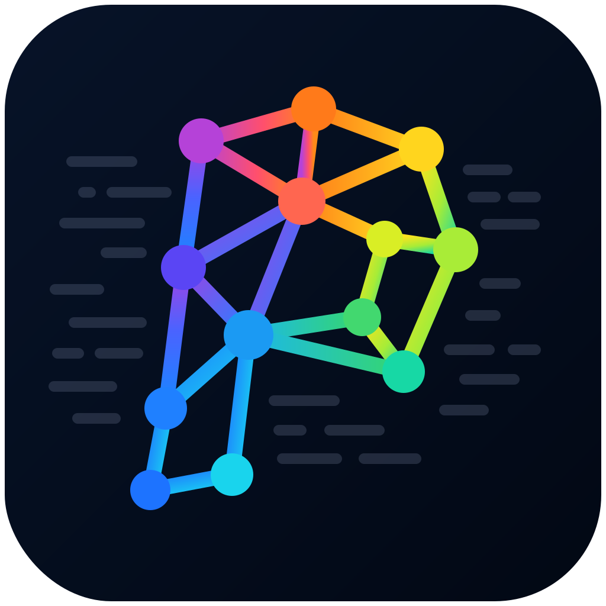

<div align="center">



# PolyGraph

**An interactive dependency-graph analyzer for codebases — across ~26 languages.**

[](https://github.com/CapsaicinBunny/PolyGraph/actions/workflows/ci.yml)
[](#license)
&nbsp;


</div>

Drop in a project folder and explore a node graph of its modules, classes, interfaces, structs,
traits, functions, and components — and the relationships between them: imports, calls,
inheritance, instantiation, composition, and JSX component usage. Supports TypeScript/JavaScript,
Python, Java, Kotlin, Rust, Go, Scala, C#, F#, C, C++, Objective-C, Swift, Zig, Haskell, Ruby, PHP,
Bash, Lua, Dart, Julia, R, Nix, OCaml, SQL, and WebAssembly.

<div align="center">

<!-- Replace docs/screenshot.png with a fresh capture of the graph. -->


</div>

## Features

- **Relationship types** (drawn automatically, no configuration)
  - `import` — module dependency edges between files
  - `call` — **type-resolved** function/method call edges (resolved via the TypeScript
    compiler, so two functions named `handle` link to the correct definition)
  - `instantiates` — `new X()` construction edges
  - `extends` / `implements` — class & interface inheritance
  - `has` — composition: a typed field/property referencing another class or interface
    (resolved through arrays and generics)
  - `injects` — dependency injection: constructor parameter types
  - `renders` — which React component renders which (JSX usage)
- **Multi-framework + paradigm role detection** — tags nodes with a role (colored + badged),
  disambiguated by the file's extension and imports: **React** (JSX), **Vue** (`.vue` SFCs +
  `defineComponent`), **Svelte**, **Angular** (`@Component` / `@Injectable` / …), and **ECS**
  (`*Component` / `*System` / `*Entity`, `defineSystem` / `defineQuery`).
- **GPU vector renderer** — a Vello (Rust→WASM, WebGPU) canvas draws every card, edge, and label
  as a crisp GPU-rendered vector, with color-coded curved animated edges and pan/zoom that stay
  smooth at thousands of nodes.
- **Light & dark mode** — a sun/moon toggle switches the whole UI, including the graph canvas.
- **External dependencies** (toggle in the toolbar, off by default) — imported npm packages, Node
  builtins, and `Bun` / `Deno` / `process` API usage appear as dashed external nodes, color-coded
  by source family. When scanning a path, nodes are enriched from `package.json` with their
  **version** and dependency type (dependency / devDependency / peer / **undeclared** — handy for
  spotting missing deps).
- **Layout algorithms** — Layered and Tree (dagre, with top-down / left-right / bottom-up /
  right-left directions), plus Radial, Circular, Grid, and Force-directed (d3-force). The view
  auto-fits on change.
- **Collapse to file level** by default; click a file to expand its classes, functions, and
  components. Edges into collapsed files aggregate to the file node automatically.
- **Filter** by relationship type, **search** nodes by name, and inspect any node in a detail
  panel — incoming/outgoing edges plus detected metadata: **UI vs feature**, **client vs server**
  (`"use client"` / `"use server"`), and **runtime** (Node / Deno / Bun).
- **Runs entirely locally** — the folder is read directly from disk by a Bun analysis sidecar
  (`sidecar/server.ts`) over loopback. Nothing is persisted or sent anywhere else.

## Getting started

```bash
bun install
bun run dev      # Next.js dev server → http://localhost:3003  ·  sidecar → http://localhost:4319
```

Open the app, paste an absolute folder path into **Scan a folder**, and explore. The sidecar reads
that folder directly from disk — nothing is uploaded or copied. (An in-browser folder picker is
also available as a fallback.)

> Requires a WebGPU-capable browser (recent Chrome or Edge) for the graph canvas.

## Scripts

```bash
bun run dev            # Next dev server (port 3003) + analysis sidecar (port 4319)
bun run build          # production build → static export in out/
bun run build:sidecar  # compile the sidecar to a standalone binary (dist/)
bun run start          # serve the static export locally (out/)
bun test               # analyzer + view unit tests
bun run lint           # oxlint
bun run format         # oxfmt
```

## How it works

For the full design — kernel, providers, the native Rust core, language packs, and the renderer —
see [docs/ARCHITECTURE.md](docs/ARCHITECTURE.md).

Two ways to feed it code:

- **Scan a path (default).** You give it an absolute folder path; the sidecar's `/scan` endpoint
  walks that directory on disk (`lib/server/scan-dir.ts`), skipping `node_modules`, build output,
  and large files, into a `{ path: source }` map. Nothing leaves your machine.
- **In-browser picker (fallback).** The browser reads the chosen folder's files into the same map
  and POSTs it to the sidecar's `/analyze` endpoint.

Either way, the map is fed to the **language kernel** (`analyzeProject()`, `lib/kernel/`), which
buckets files by extension and hands each to a provider that emits a shared `GraphModel`:

- **TypeScript / JavaScript** → a precise, ts-morph-backed provider (`lib/analyzer/`) with
  type-resolved calls and JSX component/renders detection.
- **Everything else** → declarative tree-sitter packs (`language-packs/<id>/`, a `pack.yaml` +
  `tags.scm`) run by a native Rust core (`analyzer-core/`, napi-rs). Adding a language is mostly a
  new pack folder.

The client projects the merged model into a view (`lib/aggregate.ts`), lays it out with dagre off
the main thread (`lib/layout.worker.ts`), and renders it on a **Vello WebGPU vector canvas**
(`vello-renderer/`, Rust→WASM) — cards, edges, and text are GPU-drawn vectors.

## Stack

| Concern       | Choice                                                     |
| ------------- | ---------------------------------------------------------- |
| App           | Next.js (App Router, static export) + Chakra UI v3         |
| Analysis      | Bun sidecar (`sidecar/server.ts`) over loopback            |
| Runtime / PM  | Bun                                                        |
| Graph render  | Vello (Rust→WASM, WebGPU) vector renderer + dagre layout   |
| Code analysis | ts-morph (TS/JS) + native tree-sitter core (Rust, napi-rs) |
| Lint / format | oxlint / oxfmt                                             |

## Project layout

```
lib/
  graph/types.ts       shared GraphModel types + id helpers
  graph/visual.ts      colors / glyphs / icons per node & edge kind
  kernel/              language kernel: provider interface, registry, tree-sitter glue
  analyzer/            ts-morph TypeScript/JS provider (the precise plugin)
  server/handlers.ts   framework-agnostic runScan / runAnalyze
  aggregate.ts         collapse/expand view projection
  layout.ts            dagre layout (+ layout.worker.ts off-main-thread)
language-packs/        declarative tree-sitter packs (one folder per language)
analyzer-core/         native Rust (napi-rs) tree-sitter analysis core
vello-renderer/        Rust→WASM WebGPU vector renderer
sidecar/server.ts      Bun analysis sidecar (loopback endpoints /scan and /analyze)
app/page.tsx           renders the Explorer (static-exported SPA)
components/            Explorer, VelloGraphCanvas, Sidebar, NodeDetailPanel, UploadDropzone
```

## License

Licensed under either of [Apache License, Version 2.0](LICENSE-APACHE) or
[MIT license](LICENSE-MIT) at your option.

Unless you explicitly state otherwise, any contribution intentionally submitted for
inclusion in this project by you, as defined in the Apache-2.0 license, shall be dual
licensed as above, without any additional terms or conditions.
